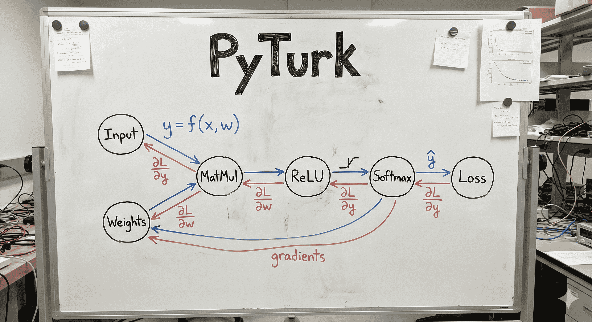

<h1 align="center">PyTurk</h1>
PyTurk is a minimal deep learning framework built on top of a micrograd-style autodiff engine. It focuses on learning, clarity and internal mechanics rather than speed or production features. 

What it has:
- [x] Micrograd
- [x] Dataset and Dataloaders
- [x] Transformation functions